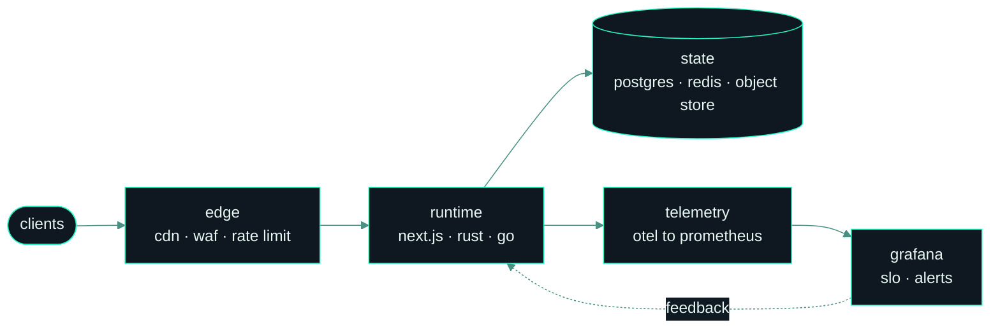

<div align="center">

<a href="https://thugg.lol"></a>


<br/>

<a href="https://thugg.lol"></a>
<a href="https://github.com/m6jo9"></a>
<a href="https://github.com/m6jo9?tab=followers"></a>




</div>

### ▸ Operating Focus

```txt
> Infrastructure as code       reproducible, reviewable, disposable
> Hardened backend systems     least privilege by default, secrets never in transit
> Observability first          if it is not measured, it is not shipped
> Minimal surface              every dependency earns its place
```

<div align="center"></div>

### ▸ Selected Work

**[thugg.lol](https://thugg.lol)** — a full platform, run solo, end to end.

| Surface | What it is | Built with |
| :-- | :-- | :-- |
| Web | profiles, file host, storefront, admin plane | Next.js App Router, Supabase, Cloudflare R2 |
| Desktop | native capture and instant share client, signed auto-updates | Tauri v2, Rust, React, TypeScript |
| Automation | giveaways, moderation, delivery pipelines | Node, Discord API, Postgres |
| Delivery | tagged releases, CDN fan-out, staged rollout | GitHub Actions, R2, minisign |

<div align="center"></div>

### ▸ Systems Stack

<div align="center">
  
  <br/>
  
  <br/>
  
</div>



<div align="center"></div>

### ▸ Signals

<div align="center">


</div>

<div align="center"></div>

### ▸ Contribution Arcade

> The grid below is my real contribution graph, rerendered every night by a workflow in this repo and played back as three games.

<div align="center">

**pacman clears the year**

<picture>
  <source media="(prefers-color-scheme: dark)" srcset="https://raw.githubusercontent.com/m6jo9/m6jo9/output/pacman-contribution-graph-dark.svg" />
  <source media="(prefers-color-scheme: light)" srcset="https://raw.githubusercontent.com/m6jo9/m6jo9/output/pacman-contribution-graph.svg" />
  
</picture>

**the snake eats the commits**

<picture>
  <source media="(prefers-color-scheme: dark)" srcset="https://raw.githubusercontent.com/m6jo9/m6jo9/output/snake-dark.svg" />
  <source media="(prefers-color-scheme: light)" srcset="https://raw.githubusercontent.com/m6jo9/m6jo9/output/snake.svg" />
  
</picture>

**breakout, for the ones that got away**

<picture>
  <source media="(prefers-color-scheme: dark)" srcset="https://raw.githubusercontent.com/m6jo9/m6jo9/output/breakout-contribution-graph-dark.svg" />
  <source media="(prefers-color-scheme: light)" srcset="https://raw.githubusercontent.com/m6jo9/m6jo9/output/breakout-contribution-graph.svg" />
  
</picture>

</div>

<details>
<summary><b>How this page builds itself</b></summary>

<br/>

The header and the dividers are hand-authored SVG in [`assets/`](./assets) — SMIL and CSS keyframes only, no runtime and no third party, and they honour `prefers-reduced-motion`.

The telemetry card and the arcade are built by [`.github/workflows/contribution-graph.yml`](./.github/workflows/contribution-graph.yml). It reads the contribution calendar, renders the stat card with [`scripts/render-stats.mjs`](./scripts/render-stats.mjs), plays pacman, breakout and the snake over the same grid, then force-pushes the frames to a single-commit `output` branch — so the animations stay fresh while the repository history stays clean.

Nothing here depends on a third-party stats service. Most of them are paused, rate-limited or gone; this page renders its own.

```txt
cron 03:41  ->  render stats card          ->  collect  ->  force-push output
                render pacman + breakout
                render snake
push main   ->  same job, immediately
```

</details>

<div align="center">


</div>
